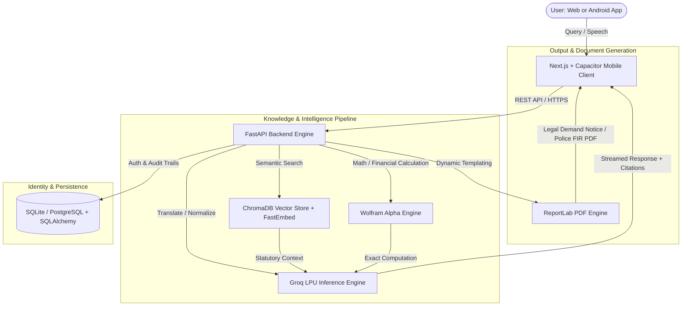

# ⚖️ NyaySetu (न्यायसेतु) — Autonomous AI Legal Aid & Document Generation Platform

<div align="center">

[](https://nyay-setu-omega.vercel.app)
[](https://github.com/PS282006/NyaySetu/raw/main/apk/NyaySetu.apk)
[](https://nyaysetu-1qbc.onrender.com)
[](LICENSE)

**Democratizing access to Indian Law through Real-Time Statutory Retrieval-Augmented Generation, Computational Restitution Engines, and Automated Legal Document Drafting.**

[Live Application](https://nyay-setu-omega.vercel.app) • [Download Android APK](https://github.com/PS282006/NyaySetu/raw/main/apk/NyaySetu.apk) • [API Documentation](https://nyaysetu-1qbc.onrender.com/docs)

</div>

---

## 📌 Problem Statement

In India, over **1.4 billion citizens** navigate one of the world's most intricate legal systems, with more than **50 million pending court cases**. Ordinary individuals face severe systemic barriers:
* **Inaccessible Legal Jargon:** Statutory acts and procedural codes are intimidating and hard to decipher.
* **Prohibitive Costs:** Quality preliminary legal advice and demand notices cost thousands of rupees.
* **Procedural Delays:** Citizens lack immediate guidance on whether an issue warrants a civil notice or a criminal Police FIR under newly enacted codes (**Bharatiya Nyaya Sanhita 2023** and **Bharatiya Nagarik Suraksha Sanhita 2023**).
* **Language & Literacy Barriers:** Legal aid is rarely accessible in regional Indian languages or voice-enabled formats.

---

## 💡 The Solution: NyaySetu

**NyaySetu (Bridge to Justice)** is an end-to-end autonomous AI legal aid platform that functions as a 24/7 intelligent paralegal for Indian citizens. It bridges the gap between raw legal statutes and practical civic action by providing instant statutory analysis, precise financial calculation, multilingual voice synthesis, and court-ready PDF generation.

---

## 🌟 Key Features

### 1. 🏛️ Statutory RAG (Retrieval-Augmented Generation)
* Semantically indexes core Indian Bare Acts including:
  * **Bharatiya Nyaya Sanhita (BNS) 2023**
  * **Bharatiya Nagarik Suraksha Sanhita (BNSS) 2023**
  * **Right to Information (RTI) Act 2005**
  * **Consumer Protection Act 2019**
  * **Maharashtra Rent Control Act 1999 & Transfer of Property Act 1882**
  * **Information Technology (IT) Act 2000**
  * **POSH Act 2013** & **Payment of Wages Act 1936**
* Provides **verifiable statutory citations** and real-time **Match Confidence %** badges on every response.

### 2. 🧮 Computational Financial Restitution Engine
* Integrates **Wolfram Alpha API** alongside high-speed Groq LPUs.
* Automatically extracts and computes compound interest on withheld security deposits, gratuity, severance pay, and statutory penalties with mathematical precision.

### 3. 📄 Automated Court-Ready Document Drafters
* **Civil Legal Demand Notices:** Instantly drafts formal, downloadable PDF demand notices complete with statutory citations, factual chronology, and a standard 15-day compliance deadline.
* **Criminal Police FIR Complaints:** Generates formal written complaints addressed to the Station House Officer (SHO) citing applicable sections under **BNSS 2023 Section 173/175** and **BNS 2023**.

### 4. 🌐 Multilingual & Voice-Enabled Accessibility
* Full cross-lingual support for **English, Hindi (हिंदी), and Marathi (मराठी)**.
* Integrated Text-to-Speech (TTS) engine enabling 1-tap audio readouts for visually impaired or low-literacy users.

### 5. 📱 Dual Platform: Web & Native Android App
* Fully responsive web application deployed globally on Vercel.
* Standalone native **Android APK** featuring 1-tap Google Authentication, offline caching, and native document sharing.

---

## 🏗️ System Architecture



---

## 🛠️ Technology Stack

| Component | Technologies Used |
|---|---|
| **Frontend UI** | Next.js 15, React 19, TypeScript, Tailwind CSS, Lucide Icons |
| **Mobile Runtime** | Capacitor 7 (Android SDK 36, Native Google Play Services Plugin) |
| **Backend Framework** | FastAPI, Uvicorn, Pydantic v2 |
| **LLM Inference** | Groq Cloud LPUs (`openai/gpt-oss-20b` with failover) |
| **Embeddings & Vector Store** | FastEmbed (`BAAI/bge-small-en-v1.5`), ChromaDB |
| **Computational Engine** | Wolfram Alpha Short Answers & Full REST API |
| **PDF Generation** | ReportLab Document Engine (Custom Indian Legal Layouts) |
| **Authentication & DB** | Google OAuth 2.0, JWT (HS256), SQLAlchemy ORM |
| **Hosting & CI/CD** | Vercel (Frontend), Render (Backend API), GitHub Releases (APK) |

---

## 🚀 Quick Start & Local Setup

### 1. Prerequisites
* Python 3.10+
* Node.js 18+
* Git

### 2. Backend Setup
```bash
# Clone the repository
git clone https://github.com/PS282006/NyaySetu.git
cd NyaySetu

# Create and activate virtual environment
python3 -m venv venv
source venv/bin/activate   # On Windows: venv\Scripts\activate

# Install dependencies
pip install -r requirements.txt

# Run the FastAPI server
uvicorn main:app --reload --port 8000
```
* Backend will be live at `http://localhost:8000`
* Interactive API Documentation (Swagger): `http://localhost:8000/docs`

### 3. Frontend Setup
```bash
cd nyaysetu-web

# Install dependencies
npm install

# Run the Next.js development server
npm run dev
```
* Frontend will be live at `http://localhost:3000`

### 4. Build Android APK
```bash
cd nyaysetu-web
npm run build
npx cap sync android
cd android && ./gradlew assembleDebug
```
* Output binary generated at `android/app/build/outputs/apk/debug/app-debug.apk`

---

## 📱 Mobile App Download

Get the official **NyaySetu Android App**:

* 📦 **Direct Download:** [`apk/NyaySetu.apk`](https://github.com/PS282006/NyaySetu/raw/main/apk/NyaySetu.apk)
* 📱 **Package Name:** `com.nyaysetu.app`
* ⚡ **Min Android Version:** Android 7.0 (Nougat) | **Target SDK:** 36 (Android 15)

---

## ⚖️ Disclaimer

*NyaySetu is an artificial intelligence-assisted legal awareness and document generation platform. It provides preliminary legal guidance based on Indian statutory laws and does not constitute formal legal representation. Users are encouraged to consult a licensed advocate for court proceedings.*
